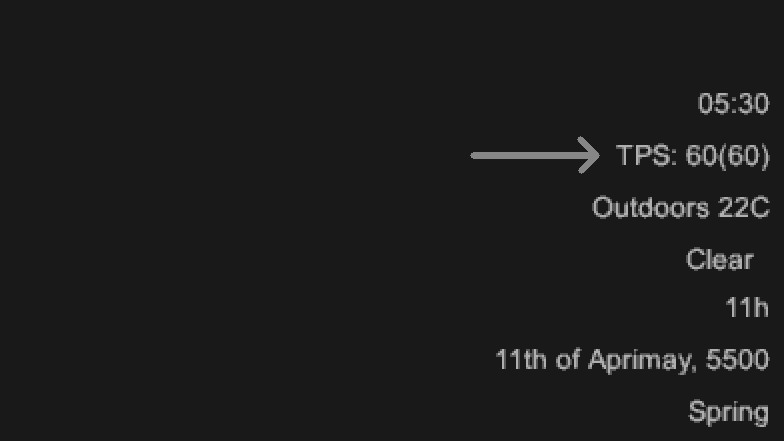

# TicksPerSecond

A mod for the game Rimworld. Add actual and target ticks per second to
the information display above the pause/speed controls.

http://github.com/sparr/rimworld-mod-TicksPerSecond

